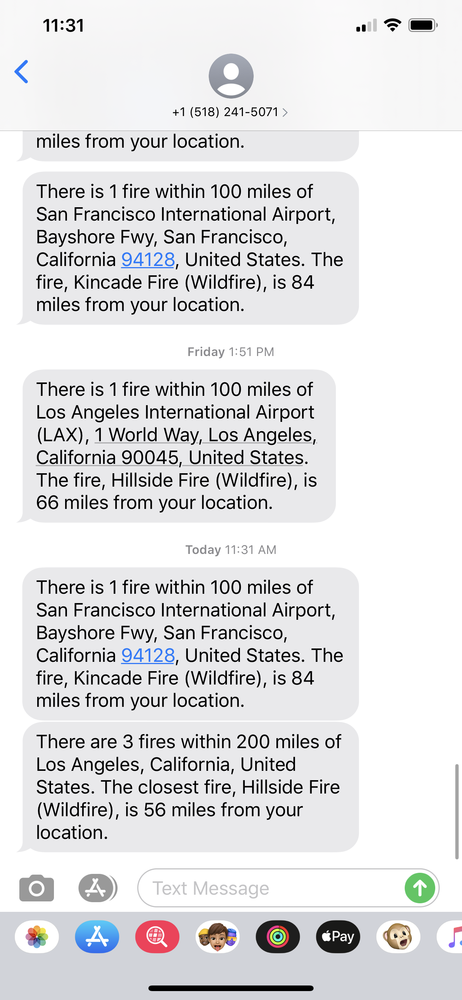
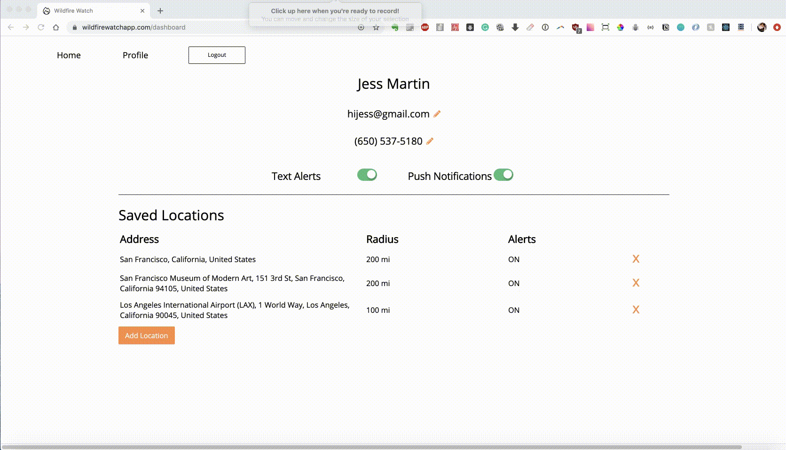

[](https://app.netlify.com/sites/fireflightapp/deploys)

# Wildfire Watch

You can find the deployed project at [wildfirewatchapp.com](https://wildfirewatchapp.com/).

## Contributors

|                                            [Alexander Stillo](https://github.com/astillo)                                            |                                         [Dora Belme](https://github.com/dorabelme)                                         |                                           [Neha Patel](https://github.com/neha-r-p)                                           |                                               [Penny Tague](https://github.com/Pmtague)                                               |                                                                                         [Lily Zhou](https://github.com/lilyhoratio)                                                                                         |
| :----------------------------------------------------------------------------------------------------------------------------------: | :------------------------------------------------------------------------------------------------------------------------: | :---------------------------------------------------------------------------------------------------------------------------: | :-----------------------------------------------------------------------------------------------------------------------------------: | :-------------------------------------------------------------------------------------------------------------------------------------------------------------------------------------------------------------------------: |
| [](https://github.com/astillo) | [](https://github.com/dorabelme) |   [](https://github.com/neha-r-p)   |       [](https://github.com/Pmtague)        | [](https://github.com/lilyhoratio) |
|                         [ ](https://github.com/astillo)                         |                   [ ](https://github.com/dorabelme)                   |                     [ ](https://github.com/neha-r-p)                     |                         [ ](https://github.com/Pmtague)                          |                                                                  [ ](https://github.com/lilyhoratio)                                                                   |
|       [  ](www.linkedin.com/in/brandon-m-porte)        | [  ](https://www.linkedin.com/in/dorabelme/) | [  ](https://www.linkedin.com/in/neha-r-patel/) | [  ](https://www.linkedin.com/in/penny-tague-93659a16/) |                                                 [  ](https://www.linkedin.com/in/lilyhzhou/)                                                  |

|                                       [Lloyd Edwards](https://github.com/tactnician)                                        |                                                                                               [Ned Horsey](https://github.com/)                                                                                                |                                         [Kobe McKee](https://github.com/kmacmckee)                                         |                                                                                        [Jeff Wicks](https://github.com/)                                                                                         |                                               [Chad Jemmett](https://github.com/ceejaay)                                               |
| :-------------------------------------------------------------------------------------------------------------------------: | :----------------------------------------------------------------------------------------------------------------------------------------------------------------------------------------------------------------------------: | :------------------------------------------------------------------------------------------------------------------------: | :--------------------------------------------------------------------------------------------------------------------------------------------------------------------------------------------------------------: | :------------------------------------------------------------------------------------------------------------------------------------: |
|  [](https://github.com/tactnician)   | [](https://github.com/Rice-from-data) |  [](https://github.com/kmacmckee)   | [](https://github.com/) |                [](https://github.com/ceejaay)                |
|                     [ ](https://github.com/livjab)                     |                                                                  [ ](https://github.com/Rice-from-data)                                                                   |                   [ ](https://github.com/kmacmckee)                   |                                                                  [ ](https://github.com/)                                                                   |                          [ ](https://github.com/ceejaay)                          |
| [  ](https://www.linkedin.com/in/tactnician/) |                                                 [  ](https://www.linkedin.com/in/edmond-horsey/)                                                 | [  ](https://www.linkedin.com/in/kobemckee/) |                                   [  ](https://www.linkedin.com/in/jeffwicks-interactiondesign/)                                   | [  ](https://www.linkedin.com/in/chad-jemmett-a3a0a347/) |

<br>
<br>

## Project Overview

Wildfire Watch is designed to help people understand when they are in danger of being struck by a wildfire, and hopefully give them time to get out.

[Trello Boards](https://trello.com/labs17forestfirewatch)

[Product Canvas](https://www.notion.so/Forest-Fire-Prediction-and-Rescue-Coordination-7eb1595c5f1643fca8e48a89c6086fdf)

UX Design files: [map](https://www.figma.com/file/MSadfIggtwfQUUUp1W6dbR/Labs17_Forest-Fire-Watch%2C-Gabby?node-id=155%3A12) & [profile](https://www.figma.com/file/MSadfIggtwfQUUUp1W6dbR/Labs17_Forest-Fire-Watch%2C-Gabby)

## Key Features

### Demo view & search autocomplete

Signed out users can demo part of the the application and see a clear "Sign Up" call-to-action. Autocomplete of searched addresses are shown in a dropdown using geocoder autocomplete. Users are directed to a login modal upon attempting to save a location.


### Login, Registration, and Change Password Modals

Use cases for incorrect inputs based on Firebase or backend server responses are indicated to the user. User authentication is handled using Firebase.


### Saved locations and fire markers

Saved locations are indicated by a green marker and fires that are within a radius (in miles) of the address are highlighted with exclamation markers. Fire distances are calculated via the haversine formula (i.e. distance between two latitude/longitude points on a sphere).


### User Profile

Users may edit their email address or phone number, and toggle on the options of receiving SMS alerts for saved locations.


### SMS notification alerts via Twilio API

Users can subscribe to SMS alerts. These alerts tell them the name of the closest fire and how many fires are within a given distance (user defined) from the saved locations. We send these alerts using the Twilio API. Notifications are re-sent every 6 hours using CRON scheduler.

<p align="center">

</p>

<!--  -->

<!--  -->

### Push notification alerts

Users can subscribe to in-browser push notifications. Like SMS alerts, they receive personalized messages based on the locations they save and the distance they set for these alerts.



### Add Location Form

Users may also add a location through a form and are prevented from adding duplicate locations.


### Fully responsive views


## Tech Stack

### Front end built using:

- ReactJS (Hooks)
- Node-Sass
- Axios
- MapBox
  - [React-Map-GL](https://www.google.com/search?q=react+mapbox+uber&oq=react+mapbox+uber&aqs=chrome..69i57j69i60.4803j0j7&sourceid=chrome&ie=UTF-8): gives the application the abilty to convert addresses to latitude/longitude for our backend applications
  - [React Mapbox Geocode](https://github.com/groinder/react-mapbox-gl-geocoder)

### [Backend](https://github.com/Lambda-School-Labs/forest-fire-watch-be) built using:

- NodeJS
- ExpressJS
- Twilio
- Firebase: email and password based authentication
- KnexJS: management of database structure
- JWT: handling authorizations
- PostgreSQL

# Environment Variables

```
REACT_APP_VAPID_PUBLIC - for push notifications
REACT_APP_MAPBOX_TOKEN - provided by Mapbox
```

# Testing

The following libraries are used for testing:

- testing-library/react
- jest
- react-test-renderer

# Installation Instructions

1.  Fork this repository.
2.  Clone this repository.
3.  Navigate into the 'fireflight' directory.
4.  Use npm install, yarn install, or pnpm install.
5.  Checkout your own branch and start hacking.

## Other Scripts

    * build - creates a build of the application
    * start - starts the production server after a build is created
    * test - runs tests in **tests** directory
    * eject - copy the configuration files and dependencies into the project so you have full control over them

# Contributing

When contributing to this repository, please first discuss the change you wish to make via issue, email, or any other method with the owners of this repository before making a change.

Please note we have a [code of conduct](./CODE_OF_CONDUCT.md). Please follow it in all your interactions with the project.

## Issue/Bug Request

**If you are having an issue with the existing project code, please submit a bug report under the following guidelines:**

- Check first to see if your issue has already been reported.
- Check to see if the issue has recently been fixed by attempting to reproduce the issue using the latest master branch in the repository.
- Create a live example of the problem.
- Submit a detailed bug report including your environment & browser, steps to reproduce the issue, actual and expected outcomes, where you believe the issue is originating from, and any potential solutions you have considered.

### Feature Requests

We would love to hear from you about new features which would improve this app and further the aims of our project. Please provide as much detail and information as possible to show us why you think your new feature should be implemented.

### Pull Requests

If you have developed a patch, bug fix, or new feature that would improve this app, please submit a pull request. It is best to communicate your ideas with the developers first before investing a great deal of time into a pull request to ensure that it will mesh smoothly with the project.

Remember that this project is licensed under the MIT license, and by submitting a pull request, you agree that your work will be, too.

#### Pull Request Guidelines

- Ensure any install or build dependencies are removed before the end of the layer when doing a build.
- Update the README.md with details of changes to the interface, including new plist variables, exposed ports, useful file locations and container parameters.
- Ensure that your code conforms to our existing code conventions and test coverage.
- Include the relevant issue number, if applicable.
- You may merge the Pull Request in once you have the sign-off of two other developers, or if you do not have permission to do that, you may request the second reviewer to merge it for you.

### Attribution

These contribution guidelines have been adapted from [this good-Contributing.md-template](https://gist.github.com/PurpleBooth/b24679402957c63ec426).

## Documentation

See [Backend Documentation](https://github.com/Lambda-School-Labs/forest-fire-watch-be) for details on the backend of our project.
